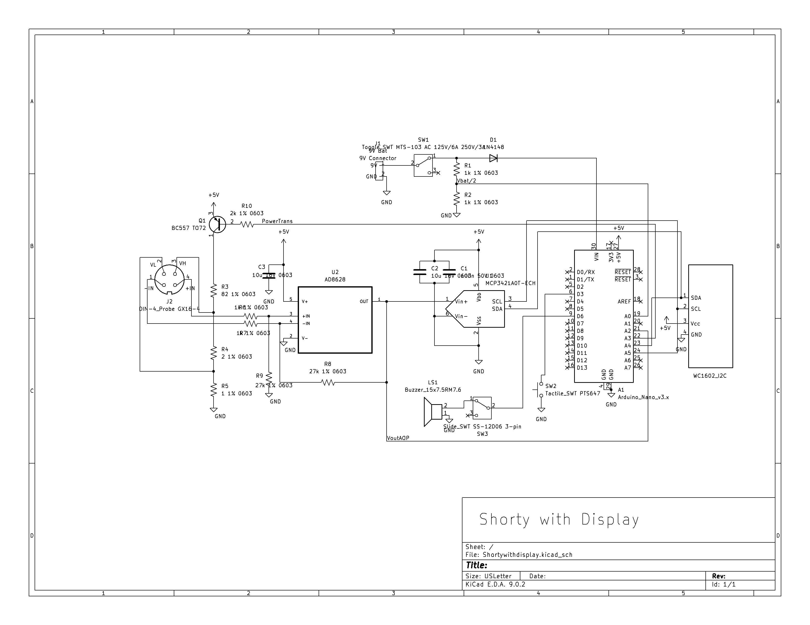
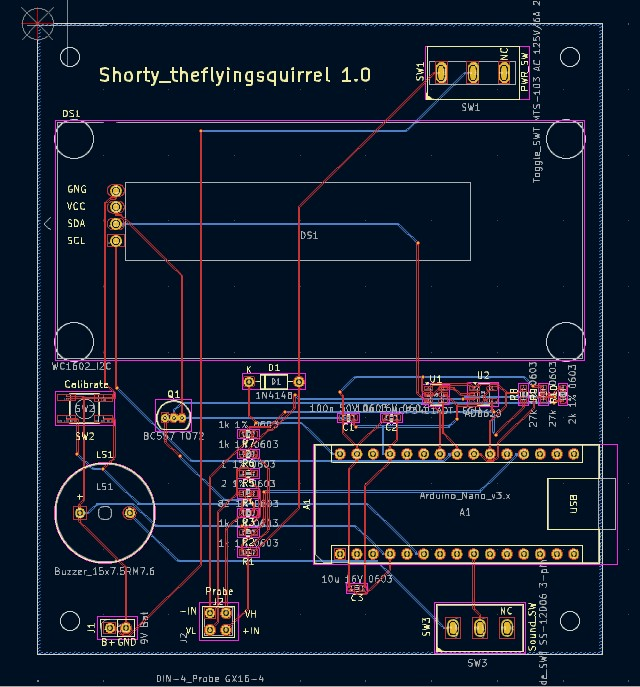

# shortywithdisplay
PCB Design for the ShortywithDisplay Project

This Project is based on the design from kripton2035 from eevblog.com
https://www.eevblog.com/forum/testgear/finding-short-on-motherboards-with-a-shorty-(with-display)/

I was fixing my laptop and thinking there is a short somewhere which is hard to pin point. I then came across this project shorty with display and am very imppressed by it. I saw everyone was soldering component onto breadbroad but no PCB was ever designed for this. I then decided to take some time to design a PCB for this so that everyone will have a easier live down the road.
This PCB is designed with KiCAD 9.0. I used mostly 0603 SMD with some through hold components. You may Thesewant to take a look at the original Project to get an idea of what this PCB is for.

These days, you can order PCB online for a really low price. This make DIY project much easier.

